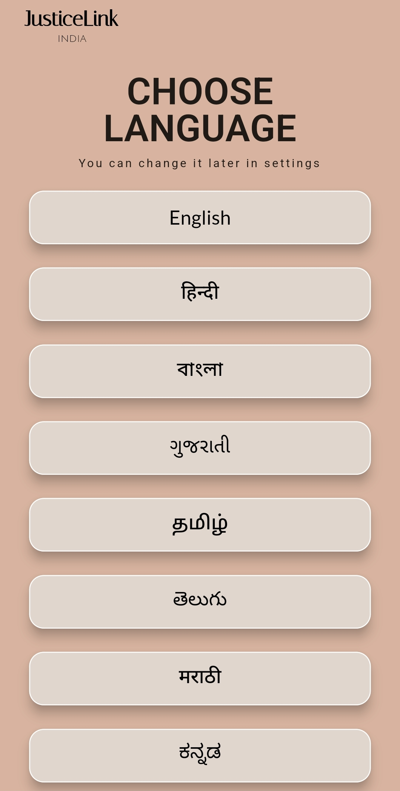
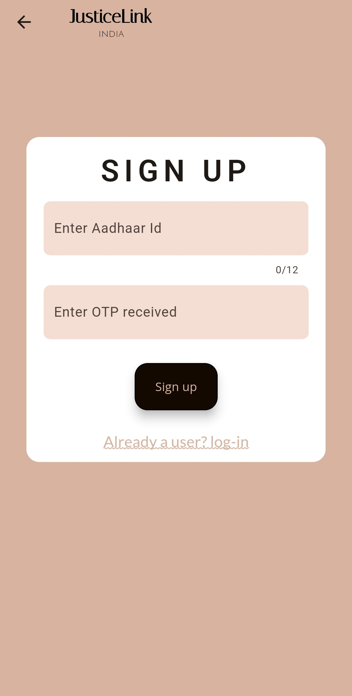
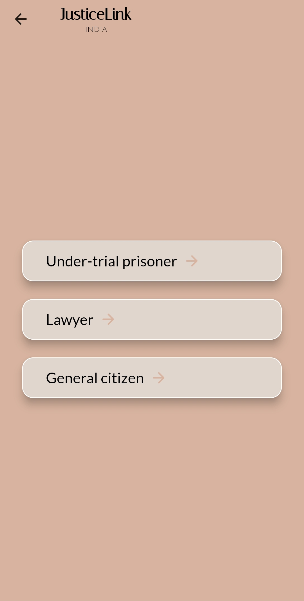
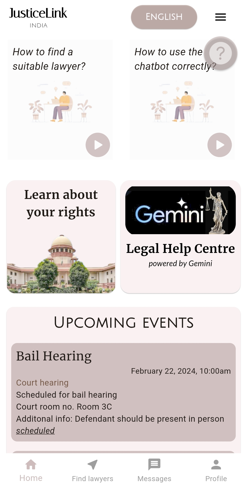
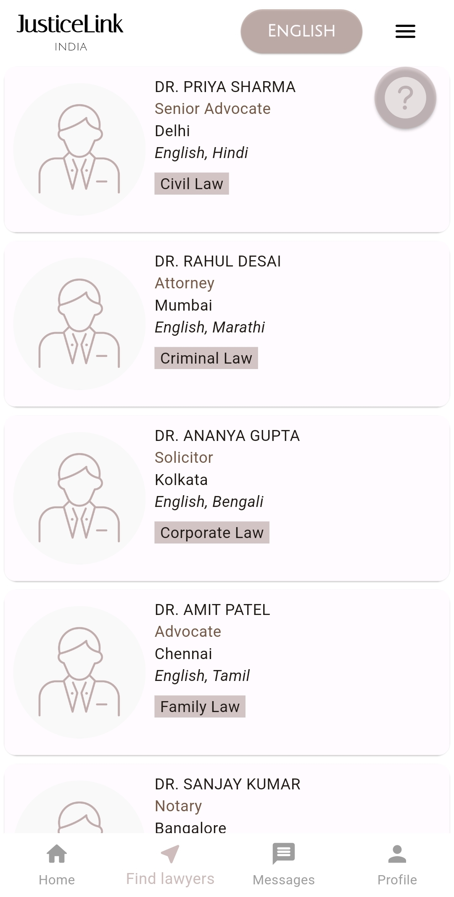
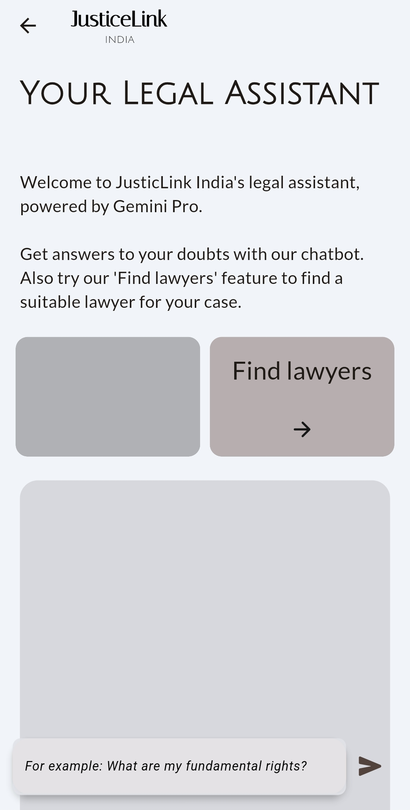
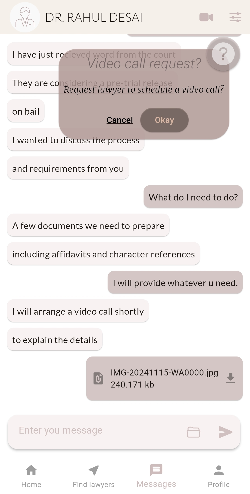
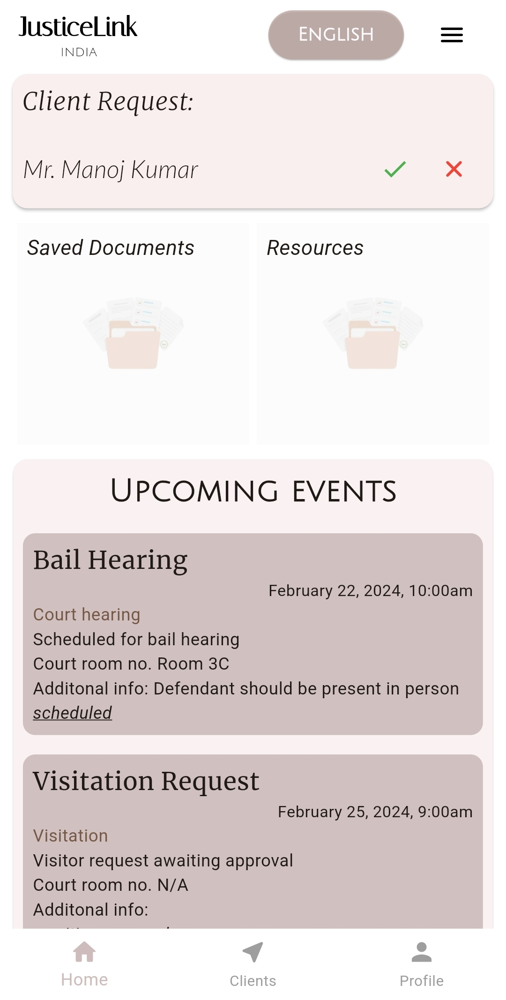

## JusticeLink India
A legal aid initiative - connecting under-trial prisoners with pro bono lawyers

- onboarding interface

  
  
  

- user interface

  
  
  
  

- lawyer home page

  

